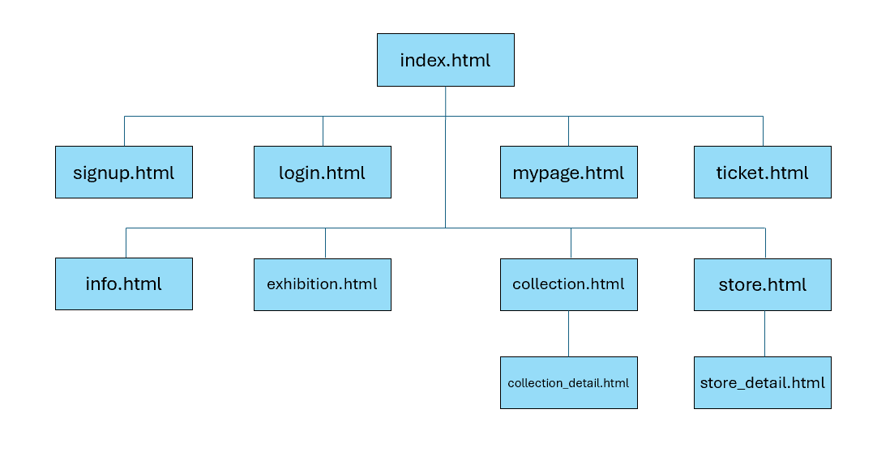
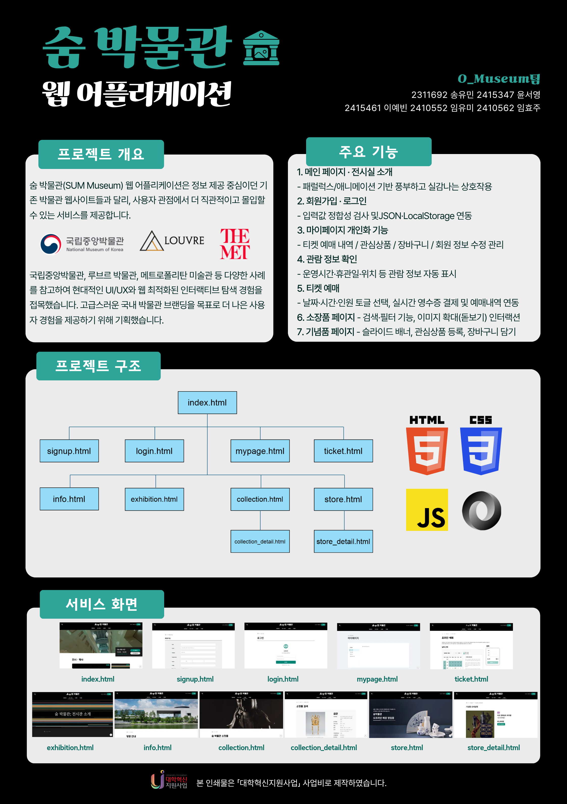

# [웹 프로그래밍 팀 프로젝트] 숨 박물관 웹사이트

## 프로젝트 개요

숨 박물관(SUM Museum) 웹 애플리케이션은 정보 제공 중심이던 기존 박물관 웹사이트와 달리,
사용자 관점에서 더 직관적이고 몰입도 높은 경험을 제공하는 것을 목표로 제작되었습니다.

국립중앙박물관, 루브르 박물관, 메트로폴리탄 미술관 등 여러 사례를 참고하여
현대적인 UI/UX와 웹 환경에 최적화된 인터랙티브 탐색 방식을 구현하였습니다.
고급스러운 국내 박물관 브랜딩을 지향하며, 사용자 중심 설계를 통해 더 나은 온라인 관람 경험을 제공합니다.

## 주요 기능

1. 박물관 메인 화면 · 전시실 소개 - 패럴럭스/애니메이션 기반의 풍부한 상호작용으로 실제 관람 같은 경험 제공
2. 회원가입 · 로그인 - 입력값 정합성 검사 및 JSON·LocalStorage 연동 기능
3. 마이페이지 개인화 기능 - 티켓 예매 내역 / 관심상품 / 장바구니 / 회원 정보 수정 관리
4. 관람 정보 확인 - 운영시간·휴관일·위치 등 관람 정보 자동 표시
5. 티켓 예매 기능 - 날짜·시간·인원 선택, 실시간 영수증, 결제 및 예매내역 연동
6. 소장품 페이지 - 검색·필터 기능, 이미지 확대(돋보기) 인터랙션 제공
7. 기념품 페이지 - 슬라이드 배너, 관심상품 등록, 장바구니 담기 기능

## 프로젝트 구조

## Tech Stack

HTML, CSS, JavaScript, JSON

## 포스터

## 실행 방법

본 프로젝트는 정적 파일 기반으로 동작하므로, VS Code의 Live Server 확장 기능을 이용해 실행하는 것을 권장합니다.